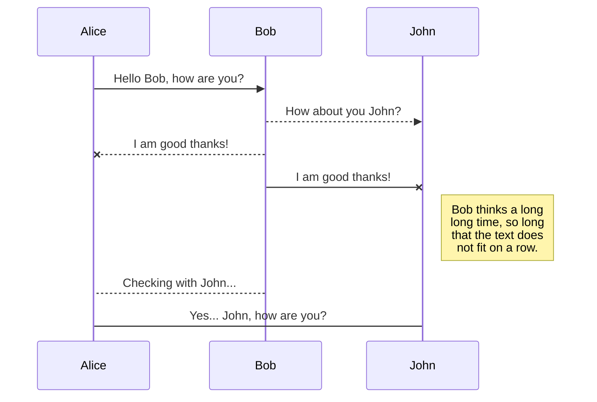

## Why I write this article

Hi I wrote this article to help other start with Office 365 and Intune, without intervention on existing tenant or start as green filed for company to begin. I hope this guide we help you to avoid misconfiguration.

## Prerequisites

Before we begin with this you will need to consider few things:  

- Is this will be LAB environment and won't be converted to production.
- Is this PoC or Pilot environment that will be converted to production.

## First Azure Active Directory Tenant
### What is Tenant ?

### Create Azure Active Directory Tenant
## Custom domian for LAB propuse without paying

## Bring you own custom domain
## Activate trial licences

### Office 365
### Intune (Enterprise Mobility Suite)

## Create Custom Accounts
